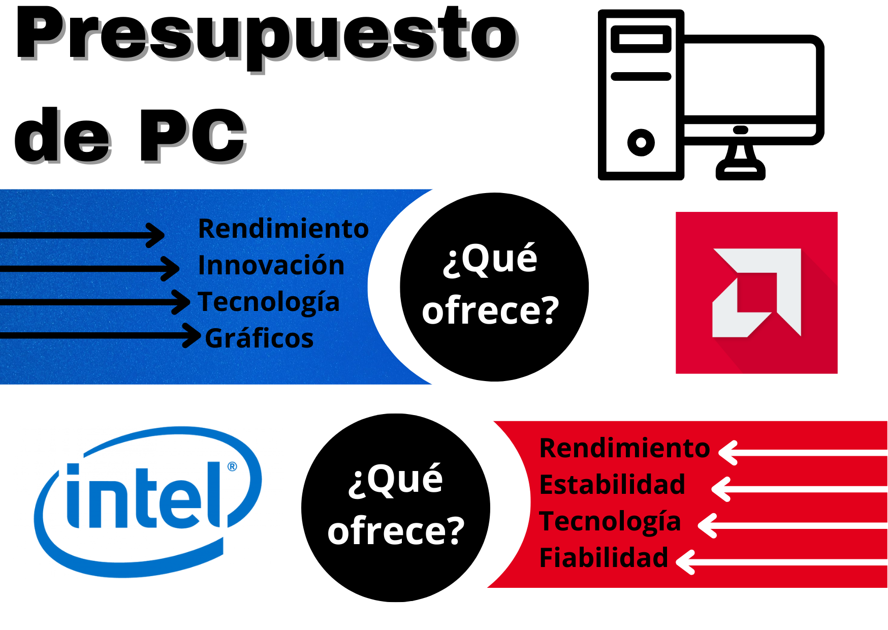

# Presupuesto PCs

#### Presupuesto Intel

| Componente             | Detalle                                                                 | Precio  |
|------------------------|-------------------------------------------------------------------------|---------|
| CPU                    | Intel Core i5-14400F 2.5/4.7GHz Box                                     | 158,95€ |
| Placa base             | ASUS PRIME B760-PLUS                                                    | 138,95€ |
| Gráfica                | MSI GeForce RTX 3050 VENTUS 2X XS OC 8GB GDDR6                          | 247,99€ |
| Disco duro             | Kingston NV3 1TB Disco SSD 6000MB/S NVMe PCIe 4.0 M.2 Gen4 2280 3D Nand | 58€     |
| Fuente de alimentación | Corsair CX750W 80 Plus Bronze                                           | 74,90€  |
| Caja                   | Tempest Shade RGB Torre ATX Negra                                       | 59,99€  |
| RAM                    | Team Group T-Force Delta RGB DDR5 6000MHz 32G 2x16GB CL30               | 108,98€ |
| Refrigeración líquida  | Cooler Master MasterLiquid 240L Core ARGB Kit de Refrigeración Líquida  | 80,99€  |
| Presupuesto total      |                                                                         | 928,75€        |

#### Presupuesto AMD

| Componente             | Detalle                                                          | Precio  |
|------------------------|------------------------------------------------------------------|---------|
| CPU                    | AMD Ryzen 7 5800X 3.8GHz                                         | 194,95€ |
| Placa base             | ASUS PRIME B550M-A WIFI II                                       | 124,94€ |
| Gráfica                | ASUS DUAL GeForce RTX 3050 V2 OC Edition 8GB GDDR6               | 242,99€ |
| Disco duro             | Kingston A400 960Gb Disco SSD SATA3 500MB/S                      | 52,01€  |
| Fuente de alimentación | Tempest PSU X 850W 80+ Bronze Modular                            | 64,99€  |
| Caja                   | Corsair 3000D AIRFLOW Cristal Templado USB 3.0 Blanca            | 63,57€  |
| RAM                    | Corsair Vengeance LPX DDR4 3200 PC4-25500 16GB 2X8GB CL 16 Negro | 37,99€  |
| Refrigeración líquida  | Tempest Liquid Cooler 360 Kit de Refrigeración Líquida Blanco    | 68,99€  |
| Presupuesto total      |                                                                  | 850,43€ |

